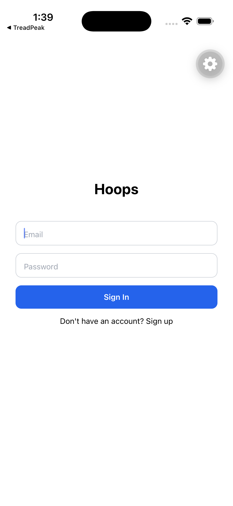
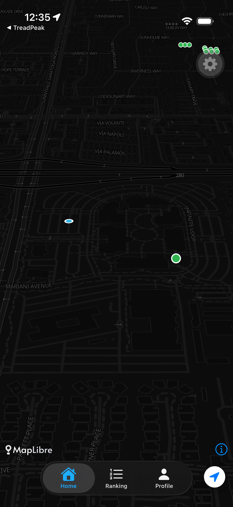
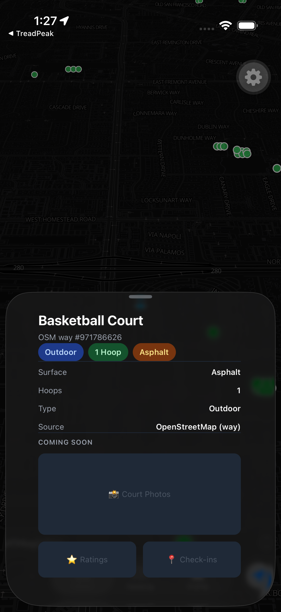

# Hoops 🏀

Pickup basketball app for iOS. Find local courts on an interactive map, and (coming soon) compete in ranked 1v1s, connect with players, and get paid.

<div align="center">
  
  
  
</div>

## Features

- **Court discovery** — pan-and-search map that queries OpenStreetMap (Overpass API) for basketball courts in the visible area and renders them as markers. 3D tilted camera, dark/light map styles, user location tracking, and zoom-gated fetching.
- **Court details** — native iOS bottom sheet with hoop count, surface, and indoor/outdoor info.
- **Court enrichment pipeline** — discovered courts sync to Supabase (PostGIS) through a PL/pgSQL batch-upsert function, so ratings, check-ins, and photos can accumulate over time.
- **Auth** — email/password sign-up and sign-in with Supabase Auth, session persistence, and auto token refresh.
- **Profile** — view your account and courts stored in Supabase.

## Tech Stack

- [Expo SDK 57](https://docs.expo.dev/versions/v57.0.0/) / React Native / TypeScript
- [Expo Router](https://docs.expo.dev/router/introduction/) (file-based routing)
- [MapLibre](https://maplibre.org/) with OpenFreeMap tiles + [Overpass API](https://wiki.openstreetmap.org/wiki/Overpass_API) for court data
- [Supabase](https://supabase.com) with PostGIS, row-level security, and spatial indexing
- [TanStack Query](https://tanstack.com/query) for caching and map state
- [@expo/ui](https://docs.expo.dev/versions/latest/sdk/ui/) native SwiftUI components (bottom sheets, symbols)
- NativeWind (Tailwind) for styling, Zustand for auth state

## Getting Started

1. Install dependencies

   ```bash
   npm install
   ```

2. Set up environment variables in `.env`

   ```bash
   EXPO_PUBLIC_SUPABASE_URL=your-supabase-project-url
   EXPO_PUBLIC_SUPABASE_PUBLISHABLE_KEY=your-supabase-publishable-key
   ```

3. Start the app

   ```bash
   npx expo start
   ```

Then press `i` to open in the iOS simulator, or scan the QR code with Expo Go.

## Database Setup

Run the migrations in the Supabase SQL Editor, in order:

1. [`supabase/migrations/001_enable_postgis_and_courts.sql`](supabase/migrations/001_enable_postgis_and_courts.sql) — enables PostGIS, creates the `courts` table (spatially indexed), and sets up RLS policies.
2. [`supabase/migrations/002_upsert_courts_function.sql`](supabase/migrations/002_upsert_courts_function.sql) — creates the `upsert_courts_from_osm` RPC function that batch-upserts OSM-discovered courts.

## Project Structure

```
src/
  app/           Expo Router screens (tabs, auth)
  components/    Map markers, court detail sheet
  hooks/         Map bounds, courts in bounds, auth state
  lib/           Supabase client, court sync, OSM queries
supabase/
  migrations/    PostGIS schema and RPC functions
```
